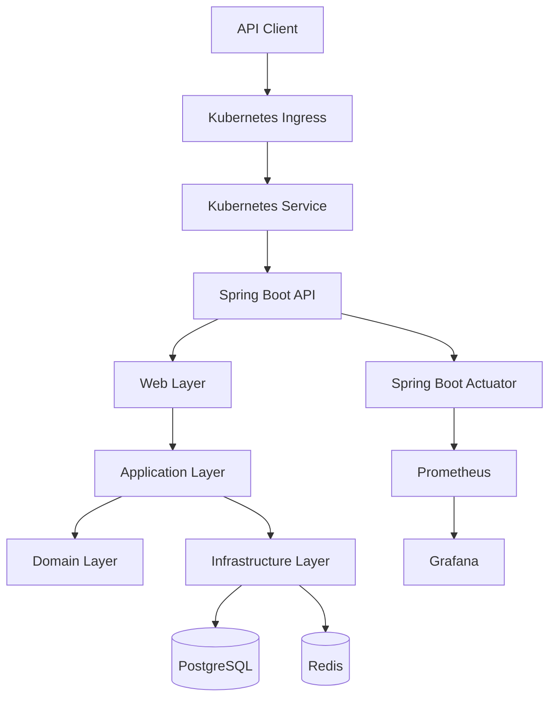
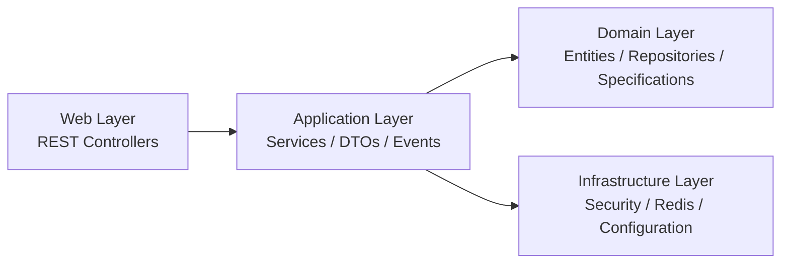
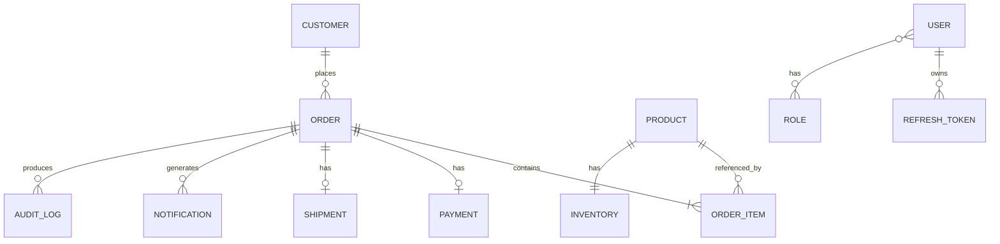
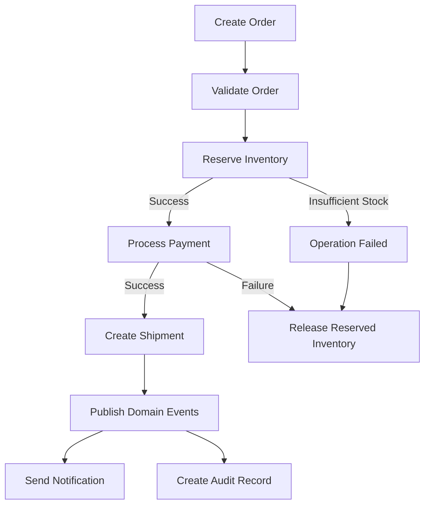
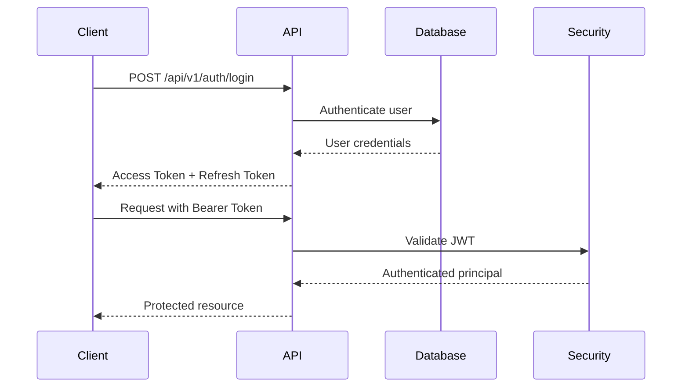
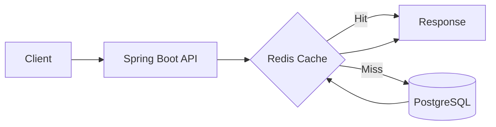
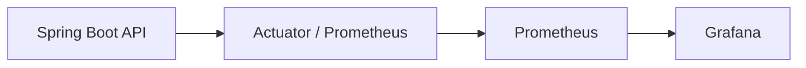

# High Performance API

A production-oriented order processing REST API built with **Java 21** and **Spring Boot 4.1.0**.

The project is designed as a realistic backend system rather than a simple CRUD application. It covers customer and product management, inventory control, order processing, payments, shipments, notifications, authentication, caching, observability, automated testing, performance testing, containerisation, and Kubernetes deployment.

---

## Overview

The API provides a complete order-processing workflow:

```text
Customer
   |
   v
Order
   |
   +--> Inventory Reservation
   |
   +--> Payment
   |
   +--> Shipment
   |
   +--> Notifications
   |
   +--> Audit
```

The application uses a layered architecture with clear separation between:

- Web/API layer
- Application layer
- Domain layer
- Infrastructure layer

The project also includes Kubernetes deployment resources, Helm configuration, Argo CD configuration, monitoring with Prometheus and Grafana, and k6 performance scenarios.

---

# Architecture

## System Architecture



---

## Application Architecture

The application follows a layered architecture:



### Web Layer

Responsible for exposing REST endpoints.

Implemented controllers include:

- `AuthController`
- `CustomerController`
- `ProductController`
- `InventoryController`
- `OrderController`
- `PaymentController`
- `ShipmentController`

### Application Layer

Contains:

- DTOs
- application services
- service implementations
- domain events
- event listeners
- gateways
- exception handling
- MapStruct mappers

### Domain Layer

Contains:

- entities
- repositories
- enums
- specifications

### Infrastructure Layer

Contains:

- Spring Security configuration
- JWT authentication
- rate limiting
- Redis configuration
- OpenAPI configuration
- application configuration
- performance data generation

---

# Domain Model

The main business entities are:

```text
BaseEntity
Customer
Product
Inventory
Order
OrderItem
Payment
Shipment
Notification
AuditLog
```

The authentication subsystem also contains:

```text
User
Role
RefreshToken
```

## Domain Relationships



---

# Order Processing

The main order workflow is implemented around inventory, payment, shipment, events, notifications, and audit.



Implemented order functionality includes:

- Order creation
- Order cancellation
- Inventory reservation
- Inventory release on cancellation
- Payment processing
- Shipment creation
- Domain events
- Notifications
- Audit logging

---

# Technology Stack

| Area | Technology |
|---|---|
| Language | Java 21 |
| Framework | Spring Boot 4.1.0 |
| API | Spring MVC / REST |
| Persistence | Spring Data JPA |
| Database | PostgreSQL |
| Database migrations | Flyway |
| Security | Spring Security |
| Authentication | JWT |
| Password hashing | BCrypt |
| Cache | Redis |
| Rate limiting | Bucket4j |
| API documentation | Springdoc OpenAPI |
| Metrics | Micrometer |
| Metrics backend | Prometheus |
| Dashboards | Grafana |
| Object mapping | MapStruct |
| Validation | Jakarta Bean Validation |
| Testing | Spring Boot Test / JUnit |
| Integration testing | Testcontainers |
| Code coverage | JaCoCo |
| Performance testing | k6 |
| Containerisation | Docker |
| Orchestration | Kubernetes |
| Kubernetes packaging | Helm |
| GitOps | Argo CD |

The Maven configuration currently uses Spring Boot 4.1.0 and Java 21 and includes the persistence, security, Redis, OpenAPI, metrics, testing, JWT, Bucket4j and JaCoCo dependencies used by the project.

---

# API

All business endpoints use the versioned base path:

```text
/api/v1
```

Examples:

```http
GET    /api/v1/customers
GET    /api/v1/customers/{id}

GET    /api/v1/products
GET    /api/v1/products/{id}

GET    /api/v1/orders
POST   /api/v1/orders

GET    /api/v1/inventories/products/{productId}
```

The API follows the project's API standards for:

- versioning
- plural resource names
- UUID identifiers
- camelCase JSON
- ISO-8601 dates
- pagination
- sorting
- filtering
- HTTP status codes

---

# API Conventions

## Versioning

The current API version is:

```text
/api/v1
```

Future major API versions can use:

```text
/api/v2
```

## HTTP Methods

| Method | Purpose |
|---|---|
| GET | Retrieve resource(s) |
| POST | Create resource |
| PUT | Replace resource |
| PATCH | Partial update / domain action where implemented |
| DELETE | Remove resource |

## Status Codes

| Code | Meaning |
|---|---|
| 200 | OK |
| 201 | Created |
| 204 | No Content |
| 400 | Bad Request |
| 404 | Not Found |
| 409 | Conflict |
| 422 | Unprocessable Entity |
| 500 | Internal Server Error |

## Pagination

Paginated endpoints use:

```text
?page=0&size=20
```

Default values:

```text
page=0
size=20
```

## Sorting

Examples:

```text
?sort=name,asc
```

```text
?sort=createdAt,desc
```

Default ordering:

```text
createdAt,desc
```

## Filtering

Filtering is performed through query parameters.

Examples:

```text
GET /api/v1/customers?email=john@email.com
```

```text
GET /api/v1/products?category=BOOKS
```

```text
GET /api/v1/orders?status=PENDING
```

---

# Authentication and Security

The API uses JWT-based authentication with Spring Security.

Authentication flow:



Implemented security features include:

- JWT authentication
- database-backed users
- roles
- BCrypt password encoding
- custom `UserDetailsService`
- JWT authentication filter
- refresh tokens
- account lockout
- rate limiting with Bucket4j
- method security
- role-based authorization
- security audit events

Authentication endpoints:

```text
POST /api/v1/auth/login
POST /api/v1/auth/refresh
POST /api/v1/auth/revoke
```

OAuth2 / OpenID Connect is not currently implemented.

---

# Caching

Redis is used as the application cache.

Implemented cache areas include:

```text
Products
Customers
```

The project includes cache eviction logic and integration tests covering Redis cache behaviour.



---

# Inventory Management

Inventory operations include:

- stock updates
- stock reservation
- stock release
- optimistic locking
- concurrent inventory testing

The inventory implementation is designed to protect stock consistency when multiple requests attempt to modify the same product inventory.

---

# Payments

The payment module supports:

- payment processing
- payment status management
- idempotency
- payment events
- payment integration tests

A fake payment gateway is used for the current implementation.

---

# Shipments

The shipment module supports:

- shipment creation
- shipment status
- tracking numbers
- shipment events
- shipment tests

---

# Notifications

The notification module currently provides simulated email notification behaviour.

Notifications are triggered through application events for scenarios including:

- order created
- payment received
- shipment created

The project includes event listeners and a fake email sender.

---

# Audit

Audit logging is implemented for relevant business and security operations.

The project contains:

```text
AuditLog
SecurityAuditService
```

and corresponding repositories, services and response DTOs.

---

# Observability

The application uses Spring Boot Actuator and Micrometer for operational visibility.

Implemented components include:

- Actuator
- Micrometer
- Prometheus
- Grafana
- structured logging
- correlation IDs using MDC

The application exposes:

```text
/actuator/health
/actuator/info
/actuator/metrics
/actuator/prometheus
```

## Health Checks

Separate Kubernetes-oriented health groups are available:

```text
/actuator/health/liveness
/actuator/health/readiness
```

Example:

```json
{
  "status": "UP"
}
```

The main health endpoint reports the liveness and readiness groups.

---

# Graceful Shutdown

The application uses Spring Boot graceful shutdown.

Configuration:

```yaml
server:
  shutdown: graceful
```

The shutdown phase has a configured timeout:

```yaml
spring:
  lifecycle:
    timeout-per-shutdown-phase: 20s
```

This allows active requests to complete before the application terminates.

The behaviour has been verified during Kubernetes pod termination.

Expected lifecycle:

```text
Kubernetes
    |
    v
SIGTERM
    |
    v
Spring Graceful Shutdown
    |
    v
Wait for active requests
    |
    v
Application shutdown
    |
    v
JPA / HikariCP shutdown
```

---

# Performance

Performance testing is implemented with **k6**.

Current scenarios include:

```text
performance/k6/products-baseline.js
performance/k6/products-search.js
```

## Products Baseline

The baseline scenario:

1. authenticates against the API;
2. obtains a JWT;
3. requests paginated products;
4. validates the response;
5. repeats the operation under increasing load.

Example endpoint:

```text
GET /api/v1/products?page=0&size=20
```

## Products Search

The search scenario tests:

```text
GET /api/v1/products?name=phone&page=0&size=20
```

The scripts use staged virtual-user increases and define an HTTP failure-rate threshold.

---

# Testing

The project contains multiple levels of automated tests.

## Unit Tests

Service-level tests cover areas such as:

- Customer
- Product
- Inventory
- Order
- Payment
- Shipment
- Notification
- Security audit
- Account lockout

## Repository Integration Tests

Repository integration tests cover:

- Customer repository
- Product repository
- Order repository
- Payment repository

## Controller Integration Tests

The project contains integration tests for:

- Authentication
- Customers
- Products
- Inventory
- Orders
- Payments
- Shipments
- Notifications

## Redis Tests

Redis-related integration tests cover:

- Redis connection factory
- product cache
- customer cache
- cache infrastructure

## Testcontainers

Testcontainers is used as part of the integration-testing setup.

## Code Coverage

JaCoCo is configured in the Maven build to generate coverage reports.

---

# Database

PostgreSQL is the primary relational database.

Database schema management is handled through Flyway.

The project currently contains migrations for:

```text
V1  Customers
V2  Products
V3  Inventories
V4  Orders
V5  Order Items
V6  Payments
V7  Shipments
V8  Notifications
V9  Audit Logs
V10 Roles
V11 Users
V12 User Roles
V13 Admin User
V14 Refresh Tokens
```

Hibernate is configured with:

```yaml
ddl-auto: validate
```

This means Hibernate validates the schema rather than creating database tables.

---

# Docker

The project contains:

```text
Dockerfile
docker-compose.yml
.dockerignore
```

Docker is used to build the application image and is also part of the local/deployment infrastructure.

Example image build:

```bash
docker build -t high-performance-api:dev .
```

---

# Kubernetes

The application has a Kubernetes deployment configuration.

Implemented Kubernetes resources include:

```text
Deployment
Service
ConfigMap
Secret
Ingress
HPA
```

The project also contains Kubernetes configuration for a local `kind` cluster.

The deployment uses:

- multiple API replicas
- readiness probes
- liveness probes
- horizontal pod autoscaling
- configuration through ConfigMaps
- sensitive configuration through Secrets

---

# Helm

A Helm chart is available under:

```text
helm/high-performance-api
```

The chart contains templates for:

```text
Deployment
Service
ConfigMap
Secret
Ingress
HPA
```

---

# Argo CD

The project contains an Argo CD application configuration:

```text
argocd/application.yaml
```

Argo CD is used as the GitOps deployment layer for the Kubernetes application.

---

# Monitoring Stack

The Kubernetes configuration includes a monitoring stack based on:

```text
Prometheus
Grafana
```

Prometheus collects application metrics exposed through:

```text
/actuator/prometheus
```

Grafana is used to visualise the collected metrics.

Architecture:



---

# Project Structure

The project is organised around application, domain, infrastructure and web concerns.

```text
src/
├── main/
│   ├── java/
│   │   └── dev/ulisses/highperformanceapi/
│   │       ├── application/
│   │       │   ├── dto/
│   │       │   ├── event/
│   │       │   ├── exception/
│   │       │   ├── gateway/
│   │       │   ├── mapper/
│   │       │   └── service/
│   │       │
│   │       ├── domain/
│   │       │   ├── entity/
│   │       │   ├── enums/
│   │       │   ├── repository/
│   │       │   └── specification/
│   │       │
│   │       ├── infrastructure/
│   │       │   ├── config/
│   │       │   ├── security/
│   │       │   └── seed/
│   │       │
│   │       └── web/
│   │           ├── AuthController.java
│   │           ├── CustomerController.java
│   │           ├── InventoryController.java
│   │           ├── OrderController.java
│   │           ├── PaymentController.java
│   │           ├── ProductController.java
│   │           └── ShipmentController.java
│   │
│   └── resources/
│       ├── application.yaml
│       └── db/
│           └── migration/
│
├── test/
│   └── java/
│
├── performance/
│   └── k6/
│
├── k8s/
│   └── ...
│
├── helm/
│   └── high-performance-api/
│
└── argocd/
    └── application.yaml
```

---

# Configuration

The application uses environment variables for environment-specific configuration.

Examples include:

```text
POSTGRES_HOST
POSTGRES_PORT
POSTGRES_DB
POSTGRES_USER
POSTGRES_PASSWORD

REDIS_HOST
REDIS_PORT
REDIS_PASSWORD

SERVER_PORT
APP_URL

JWT_SECRET
JWT_EXPIRATION
JWT_REFRESH_EXPIRATION
```

Sensitive configuration should not be committed to source control.

---

# API Documentation

OpenAPI documentation is provided through Springdoc.

OpenAPI specification:

```text
/v3/api-docs
```

Swagger UI is also available through the Springdoc WebMVC UI integration.

The OpenAPI configuration defines:

- API title
- API version
- API description
- server information
- MIT licence
- JWT Bearer authentication

---

# Local Development

## Prerequisites

Recommended tools:

- Java 21
- Maven Wrapper
- Docker
- PostgreSQL
- Redis
- kubectl
- kind

The project includes Maven Wrapper scripts:

```text
./mvnw
mvnw.cmd
```

## Build

On Linux/macOS:

```bash
./mvnw clean package
```

On Windows:

```powershell
.\mvnw.cmd clean package
```

## Build without tests

```bash
./mvnw clean package -DskipTests
```

## Docker image

```bash
docker build -t high-performance-api:dev .
```

---

# Kubernetes Development

The current development workflow uses a local `kind` Kubernetes cluster.

Typical workflow:

```bash
./mvnw clean package -DskipTests

docker build -t high-performance-api:dev .

kind load docker-image high-performance-api:dev --name high-performance-api

kubectl rollout restart deployment/high-performance-api

kubectl rollout status deployment/high-performance-api
```

Check the API pods:

```bash
kubectl get pods -l app=high-performance-api
```

Check deployment status:

```bash
kubectl get deployment high-performance-api
```

Check services:

```bash
kubectl get services
```

---

# Health Verification

Check the application health:

```bash
curl http://localhost:8080/actuator/health
```

Liveness:

```bash
curl http://localhost:8080/actuator/health/liveness
```

Readiness:

```bash
curl http://localhost:8080/actuator/health/readiness
```

The application should report:

```json
{
  "status": "UP"
}
```

---

# Observability Access

The Kubernetes monitoring stack provides Prometheus and Grafana services.

For local development, services can be exposed using port forwarding.

Example:

```bash
kubectl port-forward svc/prometheus 9090:9090
```

Prometheus:

```text
http://localhost:9090
```

Grafana:

```bash
kubectl port-forward svc/grafana 3000:3000
```

Grafana:

```text
http://localhost:3000
```

---

# Development Principles

The project follows several backend engineering principles:

- RESTful API design
- API versioning
- separation of concerns
- DTO-based API contracts
- MapStruct mapping
- database migrations
- optimistic locking
- idempotent payment operations
- stateless JWT authentication
- role-based authorization
- caching
- rate limiting
- structured logging
- correlation IDs
- health checks
- graceful shutdown
- automated testing
- containerisation
- Kubernetes deployment
- observable services
- performance testing

---

# Production Readiness

Sprint 17 focuses on moving the project from a functional backend towards a production-oriented service.

## Completed

- [x] API versioning
- [x] Global API documentation review
- [x] Health checks
- [x] Graceful shutdown

## Deferred

The following Sprint 17 items are intentionally deferred:

- [ ] Problem Details — RFC 9457
- [ ] Docker Compose — Full Stack
- [ ] CI/CD — GitHub Actions
- [ ] SonarQube
- [ ] Dependabot

These items are planned future work and are **not currently presented as implemented features**.

---

# Roadmap

```text
Sprint 1  — Project Bootstrap                         [x]
Sprint 2  — Repository / DTO / API Foundation         [x]
Sprint 3  — Customer                                  [x]
Sprint 4  — Product                                   [x]
Sprint 5  — Inventory                                 [x]
Sprint 6  — Order Processing                          [x]
Sprint 7  — Payments                                  [x]
Sprint 8  — Shipments                                 [x]
Sprint 9  — Notifications                             [x]
Sprint 10 — Security                                  [x]
Sprint 11 — Advanced Security                         [x]
Sprint 12 — Redis                                     [x]
Sprint 13 — Observability                             [x]
Sprint 14 — Testing                                   [x]
Sprint 15 — Performance                               [x]
Sprint 16 — Kubernetes                                [x]
Sprint 17 — Production Readiness                      [~]
```

### Sprint 17

```text
[x] API Versioning
[x] Global API Documentation Review
[x] Health Checks
[x] Graceful Shutdown

[ ] Problem Details (RFC 9457)
[ ] Docker Compose — Full Stack
[ ] CI/CD — GitHub Actions
[ ] SonarQube
[ ] Dependabot
```

---

# API Standards

The project follows the API standards defined for the application.

Key conventions include:

```text
Base path: /api/v1

JSON: camelCase

IDs: UUID

Dates: ISO-8601

Enums: UPPER_CASE

Pagination:
?page=0&size=20

Sorting:
?sort=createdAt,desc
```

For the complete API conventions, see:

```text
API Standards.txt
```

---

# Performance Test Scenarios

The current k6 scenarios are:

```text
performance/k6/products-baseline.js
performance/k6/products-search.js
```

Both scenarios authenticate through:

```text
POST /api/v1/auth/login
```

and then execute authenticated product requests using the returned JWT.

Example:

```text
GET /api/v1/products?page=0&size=20
```

Search example:

```text
GET /api/v1/products?name=phone&page=0&size=20
```

---

# Project Status

The core order-processing platform is implemented and deployed locally through Kubernetes.

The project currently demonstrates:

```text
REST API
    +
Security
    +
Persistence
    +
Caching
    +
Business Workflows
    +
Events
    +
Testing
    +
Observability
    +
Performance Testing
    +
Docker
    +
Kubernetes
    +
Helm
    +
Argo CD
```

The remaining production-readiness work is tracked in the Sprint 17 roadmap.

---

# License

MIT License
